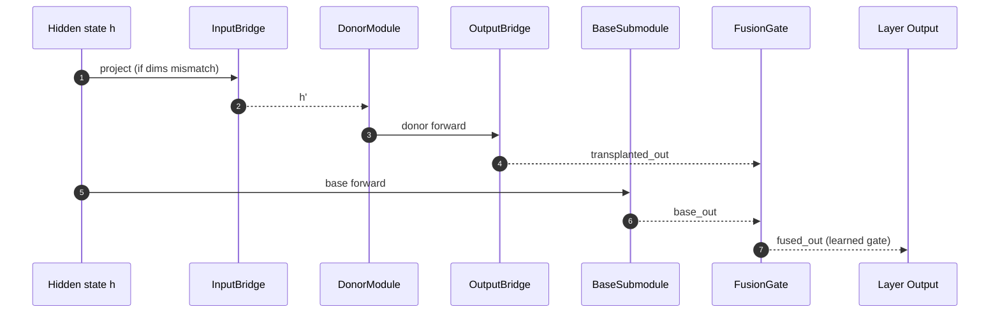

# LLM Ripper

A production-ready framework for modular deconstruction, analysis, and recomposition of knowledge in Transformer-based language models.

## Overview

LLM Ripper implements a comprehensive framework based on cutting-edge research for:
- **Part I**: Architectural dissection and knowledge extraction from donor models
- **Part II**: Analysis and synthesis of extracted knowledge components  
- **Part III**: Recomposition and validation in new architectures

This framework enables researchers and practitioners to systematically extract, analyze, and transplant knowledge components between different language models, opening new possibilities for model composition and knowledge transfer.

## Key Features

- **Modular Knowledge Extraction**: Extract embeddings, attention heads, FFN layers, and LM heads with architecture-sensitive handling
- **Dynamic Activity Capture**: Efficient activation capture using torch.fx for large-scale analysis
- **Comprehensive Analysis**: Semantic coverage, attention interpretability, and conceptual clustering metrics
- **Knowledge Transplantation**: Advanced transplantation using Bridge Networks and parameter-efficient adapters
- **Multi-level Validation**: Intrinsic and extrinsic validation protocols with comprehensive benchmarks
  - Online (default): GLUE (CoLA/STS-B), CoNLL2003 (POS/NER linear probes), CommonsenseQA
  - Offline: synthetic datasets for reproducible, no-network environments
  - **Causal Tracing**: Pluggable interventions (zero/noise/mean-patch) with per-target Δ-metrics and ranked impact
  - **Counterfactuals**: Minimal-pair generator + evaluator producing Δ per pair with confound controls
  - **Uncertainty (UQ)**: MC‑Dropout predictive entropy, MI (BALD), ECE; routing simulation for fallback
  - **Alignment & Bridges**: Orthogonal Procrustes donor→target embedding alignment; mixture‑of‑bridges training
  - **Feature Discovery**: SAE/RepE‑lite catalog from activations with labeled latent features
  - **Interop**: Global merge (average), adapter import/fusion, tokenizer alignment mapping
  - **Safety & Reporting**: Provenance scanner (licenses/metadata/hashes), IDEAL‑style JSON/MD/PDF report, stress/Drift (PSI/KL)
  - **Studio (MVP)**: Lightweight static UI with Catalog, Trace, and Transplant+Validate panes

### Basic Usage Examples

**⚠️ Note: All model names below are examples only. Replace with your actual model paths or HuggingFace model identifiers.**

```bash
# Extract knowledge from a donor model (EXAMPLE)
llm-ripper extract --model "model-name-here" --output-dir ./knowledge_bank
## Optional: force base model load (faster when not extracting lm_head)
# llm-ripper extract --model "model-name-here" --output-dir ./knowledge_bank --model-type base

# Capture dynamic activations (EXAMPLE)  
llm-ripper capture --model "model-name-here" --output-file ./activations.h5 --dataset wikitext
## Offline/synthetic corpus and dataset-mode HDF5
# HDF5_STORE_MODE=dataset llm-ripper capture --model "model-name-here" --output-file ./activations.h5 --offline
## Capture via model outputs (no hooks/FX)
# USE_MODEL_OUTPUTS=true llm-ripper capture --model "model-name-here" --output-file ./activations.h5 --offline

# Analyze extracted components
llm-ripper analyze --knowledge-bank ./knowledge_bank --activations ./activations.h5 --output-dir ./analysis
## Emit JSON output for automation
# llm-ripper analyze --knowledge-bank ./knowledge_bank --output-dir ./analysis --json

# Transplant components to a target model (EXAMPLE)
llm-ripper transplant --source ./knowledge_bank --target "model-name-here" --output-dir ./transplanted

# Validate transplanted model
llm-ripper validate --model ./transplanted --baseline "model-name-here" --output-dir ./validation_results
## By default (online), validation uses real benchmarks: GLUE (CoLA/STS-B), CoNLL2003 (POS), CommonsenseQA
## Add --offline to use synthetic offline datasets instead
```

### Utility

```bash
# Inspect knowledge bank contents/metadata
llm-ripper inspect --knowledge-bank ./knowledge_bank

# Reattach transplanted artifacts to a saved model
llm-ripper reattach --transplanted-dir ./transplanted --offline --json
```

### Architecture Diagram

```mermaid
flowchart TD
  %% Donor & Knowledge
  A[Donor Model] -->|extract| KB[Knowledge Bank]
  A -->|capture| ACT[Activations (HDF5)]
  KB -->|analyze| ANALYSIS[Analysis & Catalog]

  %% Interop & Bridges
  subgraph interop [Interop & Bridges]
    direction TB
    MERGE[merge --global]:::op
    ADAPT[adapters --import/--fuse]:::op
    TOK[tokenize-align]:::op
    ALIGN[bridge-align]:::op
    BTRAIN[bridge-train --mixture]:::op
  end

  ANALYSIS --> ALIGN
  KB --> ALIGN
  TOK --> ALIGN
  MERGE --> MRGD[Merged Model]
  MRGD --> TRANS[Transplanted Model]
  KB -->|transplant| TRANS
  ADAPT --> TRANS
  ALIGN --> BTRAIN
  BTRAIN --> TRANS

  %% Causal & Evaluation
  subgraph eval [Causal & Evaluation]
    direction TB
    T[trace]:::op
    CFGEN[cfgen]:::op
    CFEVAL[cfeval]:::op
    UQ[uq]:::op
    ROUTE[route-sim]:::op
  end

  ANALYSIS --> T
  A --> T
  CFGEN --> CFEVAL
  A --> CFEVAL
  TRANS -->|validate --mechanistic| VAL[Validation]
  TRANS -->|uq| UQ
  UQ --> ROUTE

  %% Safety & Reporting
  subgraph report [Safety & Reporting]
    direction TB
    PROV[provenance]:::op
    STRESS[stress]:::op
    REPORT[report (JSON/MD/PDF)]:::op
    STUDIO[Studio MVP]:::op
  end

  TRANS --> PROV
  TRANS --> STRESS
  VAL --> REPORT
  UQ --> REPORT
  PROV --> REPORT
  STRESS --> REPORT
  REPORT --> STUDIO

  classDef op fill:#eef,stroke:#446,stroke-width:1px;
```

### Transplant Injection Flow



### Strategy Decision Flow

```mermaid
flowchart TD
  S([Start]) --> A{Aligned donor->target?<br/>(cos up, MSE down)}
  A -->|No| BA[Run bridge-align]
  BA --> A
  A -->|Yes| T{High delta-impact targets?<br/>(trace)}
  T -->|Yes| INJ[Module injection + bridges]
  T -->|No| V{Need vocab/semantics transfer?}
  V -->|Yes| EMB[Embedding initialization]
  V -->|No| H{Heterogeneous tasks?}
  H -->|Yes| MOB[Mixture-of-bridges training]
  H -->|No| L{Multiple candidates per layer?}
  L -->|Yes| AF[Adapter Fusion]
  L -->|No| VAL[Validate + UQ]

  INJ --> VAL
  EMB --> VAL
  MOB --> VAL
  AF  --> VAL

  VAL --> CF[Counterfactuals (cfgen/cfeval)]
  VAL --> UQ[UQ + route-sim (tau)]
  UQ  --> REP[Report + Studio]
  CF  --> REP

```

#### Decision Node Examples

- Alignment: reduce distortion donor→target
  - `llm-ripper bridge-align --source ./knowledge_bank --target <model> --out ./transplants/W_align`
- High Δ-impact targets (trace):
  - `llm-ripper trace --model <model> --targets head:0.q,ffn:0.up --metric nll_delta --intervention zero`
- Module injection + bridges:
  - `llm-ripper transplant --source ./knowledge_bank --target <model> --output-dir ./transplants --strategy module_injection --source-component layer_0_ffn --target-layer 0`
- Embedding initialization:
  - `llm-ripper transplant --source ./knowledge_bank --target <model> --output-dir ./transplants --strategy embedding_init --source-component embeddings`
- Mixture-of-bridges training:
  - `llm-ripper bridge-train --model <model> --layer 6 --mixture 4 --steps 100`
- Adapter Fusion (multi-adapter layer):
  - `llm-ripper adapters --model ./transplants/model --import lora.safetensors --layer 3 --fuse`
- Validate + UQ:
  - `llm-ripper validate --model ./transplants --mechanistic --output-dir ./validation`
  - `llm-ripper uq --model ./transplants --samples 10 --max-texts 64`
  - `llm-ripper route-sim --metrics runs/<stamp>/uq/metrics.jsonl --tau 0.7`
- Counterfactuals:
  - `llm-ripper cfgen --task agreement --n 2000 --out ./counterfactuals/pairs.jsonl`
  - `llm-ripper cfeval --model ./transplants --pairs ./counterfactuals/pairs.jsonl --out ./counterfactuals/results.jsonl`
- Report + Studio:
  - `llm-ripper report --ideal --out ./reports --from ./runs/<stamp>`
  - `llm-ripper studio --root ./runs/<stamp> --port 8000`

### Run Artifacts Layout

```
runs/<stamp>/
  knowledge_bank/
  activations/
  analysis/
  transplants/
  validation/
  causal/
  traces/
  counterfactuals/
  uq/
  catalog/
  provenance/
  reports/
```

### Makefile Demo Targets

```bash
# Full end-to-end pipeline (uses MODEL for both donor/baseline)
make demo-full MODEL=gpt2

# Quick trace and UQ demos
make demo-trace MODEL=gpt2
make demo-uq MODEL=gpt2

# Launch Studio on the latest run (or pass RUN_ROOT)
make studio         # uses latest under runs/
make studio RUN_ROOT=runs/20240101-120000-0001
```

### New CLI Commands (Causal, UQ, Interop, Safety)

```bash
# 1) Causal Tracing: rank impact of heads/FFN parts
llm-ripper trace \
  --model <path_or_hf> \
  --targets head:12.q:0,ffn:7.up \
  --metric nll_delta --intervention zero --max-samples 64 --seed 42

# 2) Counterfactuals: generate + evaluate minimal pairs
llm-ripper cfgen --task agreement --n 5000 --out ./counterfactuals/pairs.jsonl
llm-ripper cfeval --model <path_or_hf> --pairs ./counterfactuals/*.jsonl --out ./counterfactuals/results.jsonl

# 3) Uncertainty + Routing
llm-ripper uq --model <path_or_hf> --samples 20 --max-texts 128
llm-ripper route-sim --metrics runs/<stamp>/uq/metrics.jsonl --tau 0.7

# 4) Alignment & Bridges
llm-ripper bridge-align --source ./knowledge_bank --target <path_or_hf> --out ./transplants/W_align
llm-ripper bridge-train --model <path_or_hf> --layer 6 --mixture 4 --steps 100

# 5) Feature Discovery (Catalog)
llm-ripper features --activations ./activations.h5 --method sae --out ./catalog --k 32

# 6) Interop: Merge, Adapters, Tokenizers
llm-ripper merge --global spec.yaml --out ./transplants/merged_model           # average weights
llm-ripper merge --global spec.yaml --micro --out ./transplants/merged_model   # + microtransplants
llm-ripper adapters --model ./transplanted/model --import lora.safetensors --layer 3 --fuse
llm-ripper tokenize-align --source gpt2 --target distilgpt2 --out ./catalog/tok_align.json

# 7) Safety & Reports
llm-ripper provenance --scan ./transplanted --fail-on-violation --json
llm-ripper stress --model ./transplanted --baseline gpt2 --out ./reports
llm-ripper report --ideal --out ./reports --from ./runs/<stamp>

# 8) Studio (MVP)
llm-ripper studio --root ./runs/<stamp> --port 8000
```

### Run Artifacts

All commands emit a standardized run under `runs/<stamp>/` for easy reproducibility and inspection:

- `knowledge_bank/` — extracted weights and configs
- `activations/` — captured activations
- `analysis/` — analysis outputs (catalogs, metrics)
- `transplants/` — transplanted models/artifacts
- `validation/` — validation results
- `causal/`, `traces/` — causal tracing outputs (JSON/JSONL)
- `counterfactuals/` — minimal pairs and evaluations
- `uq/` — uncertainty metrics and summary
- `catalog/` — feature catalogs
- `provenance/` — provenance and compliance records
- `reports/` — final reports (JSON/MD/PDF)

### Configuration

Install

```bash
pip install -e .
```

Device and performance flags can be set via environment variables or CLI flags.

Examples:
- DEVICE=auto|cuda|cpu|mps
- LOAD_IN_8BIT=true (requires bitsandbytes)
- LOAD_IN_4BIT=true (requires bitsandbytes)
- TRUST_REMOTE_CODE=true
- USE_MODEL_OUTPUTS=true (capture via model outputs)
 - HDF5_STORE_MODE=groups|dataset
 - STORE_ATTN_PER_HEAD=true|false
- COMPILE_MODEL=true (PyTorch 2+)
 - HDF5_STORE_MODE=groups|dataset
 - STORE_ATTN_PER_HEAD=true|false


Set environment variables for your specific models:

```bash
# EXAMPLES - Replace with your actual model identifiers
export DONOR_MODEL_NAME="your-donor-model-name-here"
export TARGET_MODEL_NAME="your-target-model-name-here" 
export HF_TOKEN="your_huggingface_token"
export WANDB_API_KEY="your_wandb_key"  # Optional for experiment tracking
export ENABLE_DOWNSTREAM_PERPLEXITY=false  # Analysis cost control
export TENSOR_SHARD_MB=512  # Shard threshold for .pt tensors

# Transplant artifacts
# After loading a transplanted model, reattach gates from artifacts for fine-tuning
# python -c "from llm_ripper.core.transplant import KnowledgeTransplanter; import transformers as T; m=T.AutoModel.from_pretrained('./transplanted/model'); from llm_ripper.utils.config import ConfigManager; print(KnowledgeTransplanter(ConfigManager()).load_transplant_artifacts(m, './transplanted/model/transplant_artifacts'))"
```

## Framework Architecture

### Part I: Knowledge Extraction
- **Static Knowledge Extraction**: Comprehensive weight extraction with safetensors support
  - Input/output embeddings with weight-tying detection
  - Attention mechanisms (MHA, GQA, MQA) with architecture-sensitive handling  
  - Feed-forward networks with activation function detection
  - Language modeling heads
- **Dynamic Knowledge Capture**: Efficient activation capture using torch.fx
  - Hierarchical HDF5 storage for scalability
  - Configurable layer and component selection
  - Memory-efficient processing for large models

### Part II: Knowledge Analysis  
- **Semantic Coverage Analysis**: Perplexity-based embedding evaluation with downstream tasks
- **Attention Head Interpretability**: 
  - Syntactic Head Score (SHS) for grammatical dependency alignment
  - Factual Head Score (FHS) through ablation studies
  - Functional classification and head catalog generation
- **FFN Conceptual Clustering**:
  - PCA-based dimensionality analysis  
  - K-means clustering with purity metrics
  - Conceptual cluster extraction and visualization

### Part III: Knowledge Recomposition
- **Bridge Networks**: Parameter-efficient adapters for dimensional compatibility
  - Bottleneck architecture with residual connections
  - Configurable hidden dimensions and activation functions
- **Transplantation Strategies**:
  - Embedding initialization with dimensional bridging
  - Module injection with frozen donor weights
  - AdapterFusion for multi-component composition
- **Validation Protocols**:
  - Intrinsic validation: Component-level preservation checks
  - Extrinsic validation: Task-specific performance benchmarks
  - Comparative analysis with baseline models

## Advanced Usage

### Troubleshooting
- trust_remote_code: pass `--yes --trust-remote-code` to explicitly allow custom model code; avoid on untrusted sources.
- Quantization (8/4-bit): requires bitsandbytes; if not installed, flags are ignored with a warning and the model loads in full precision.
- Offline use: add `--offline` to avoid dataset/model downloads; use local paths for models or ensure they are cached in `MODEL_CACHE_DIR`.
- Device selection: default is `auto`; override with `--device cuda|cpu|mps`.
- Attentions via outputs: set `USE_MODEL_OUTPUTS=true` to capture `hidden_states/attentions` without FX/hooks.

### Complete Pipeline Example
```python
from llm_ripper import KnowledgeExtractor, KnowledgeAnalyzer, KnowledgeTransplanter

# Initialize with configuration
config = ConfigManager("config.json")
extractor = KnowledgeExtractor(config)
analyzer = KnowledgeAnalyzer(config)  
transplanter = KnowledgeTransplanter(config)

# Extract knowledge (EXAMPLE model names)
extraction_result = extractor.extract_model_components(
    model_name="example-donor-model",
    output_dir="./knowledge_bank"
)

# Analyze components
analysis_result = analyzer.analyze_knowledge_bank(
    knowledge_bank_dir="./knowledge_bank",
    output_dir="./analysis"
)

# Transplant to target model (EXAMPLE)
transplant_result = transplanter.transplant_knowledge(
    source_knowledge_bank="./knowledge_bank",
    target_model_name="example-target-model", 
    transplant_configs=configs,
    output_dir="./transplanted"
)
```

### Custom Transplant Configurations
```json
[
  {
    "source_component": "layer_5_attention",
    "target_layer": 3,
    "bridge_hidden_size": 64,
    "freeze_donor": true,
    "strategy": "module_injection"
  },
  {
    "source_component": "embeddings", 
    "target_layer": 0,
    "bridge_hidden_size": 32,
    "strategy": "embedding_init"
  }
]
```

## Contributing

Maintainer: qrv0 (qorvuscompany@gmail.com)


We welcome contributions! Please see our contributing guidelines for:
- Code style and testing requirements
- Documentation standards
- Feature request and bug report processes

## License

Licensed under the Apache License, Version 2.0. See LICENSE file for details.

## Disclaimer

All model names used in examples are placeholders — replace with your own identifiers or local paths. Ensure proper licensing for any models and datasets you use, and comply with provider terms of service.
## Compatibility Matrix

- GPT‑2/GPT‑J/OPT: resolves attention at `transformer.h.{i}.attn` / `h.{i}.attn` and FFN at `transformer.h.{i}.mlp` / `h.{i}.mlp`.
- LLaMA/Mistral: resolves attention at `model.layers.{i}.self_attn` and FFN at `model.layers.{i}.mlp`.
- BLOOM: resolves attention at `transformer.h.{i}.self_attention` and FFN at `transformer.h.{i}.mlp`.
- T5 (encoder‑decoder): encoder/decoder attention at `encoder.block.{i}.layer.0.SelfAttention` / `decoder.block.{i}.layer.0.SelfAttention`; FFN at `*.layer.1.DenseReluDense`.
- Generic: falls back to `transformer.layers.{i}.attention|ffn`, `decoder.layers.{i}.self_attn|mlp`, `encoder.layers.{i}.self_attn|mlp`.

Extraction, analysis, and transplantation use these patterns via `utils/architecture.py`. You can force `--model-type base` for extraction when LM head isn’t needed.


