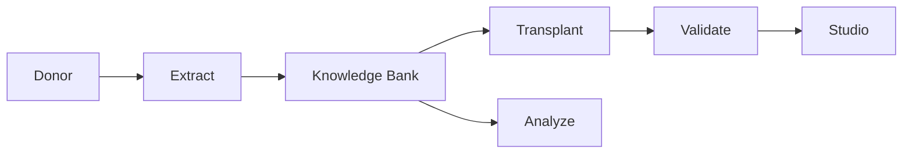

# LLM Ripper

[](https://github.com/qrv0/LLM-Ripper/actions/workflows/ci.yml)
[](https://badge.fury.io/py/llm-ripper)
[](https://pypi.org/project/llm-ripper/)
[](https://www.python.org/downloads/)
[](LICENSE)
[](https://qrv0.github.io/LLM-Ripper)
[](https://codecov.io/gh/qrv0/LLM-Ripper)
[](https://github.com/qrv0/LLM-Ripper/stargazers)
[](https://github.com/qrv0/LLM-Ripper/network/members)

A production-oriented framework for modular deconstruction, analysis, and recomposition of knowledge in Transformer-based language models.

🎉 **Now available on PyPI!** Install with `pip install llm-ripper`

### Key Features

- 🔬 **Extract** interpretable components from LLMs (embeddings, heads, FFNs)
- 📊 **Analyze** and catalog attention/MLP behaviors
- 🔄 **Transplant** knowledge across models with safety gates
- ✅ **Validate** outcomes with quantitative checks and reports
- 🛡️ **Safe** model loading with explicit `--trust-remote-code` flow
- 🔄 **Reproducible** runs with standardized artifact layout
- 👀 **Studio** viewer for quick inspection of outputs

## Table of Contents
- [Installation](#installation)
- [Quick Start](#quick-start)
- [CLI Overview](#cli-overview)
- [Examples](#examples)
- [Configuration](#configuration)
- [Architecture](#architecture)
- [Development](#development)
- [Troubleshooting](#troubleshooting)
- [License](#license)

## Pipeline Overview

**Modular pipeline:** capture → analyze → extract → transplant → validate

- 🔄 **Reproducible runs** with standardized artifact layout (see RunContext)
- 🔧 **Interop utilities** for adapters and merges

## Installation

### 🚀 Quick Install from PyPI

```bash
pip install llm-ripper
```

### 🔧 Development Install

```bash
git clone https://github.com/qrv0/LLM-Ripper.git
cd LLM-Ripper
pip install -e .
```

### 📦 Optional Dependencies

```bash
# For visualization features
pip install llm-ripper[viz]

# For spaCy integration
pip install llm-ripper[spacy]

# For Weights & Biases logging
pip install llm-ripper[wandb]

# For NLP utilities
pip install llm-ripper[nlp]

# Install all extras
pip install llm-ripper[viz,spacy,wandb,nlp]
```

### 🎯 Quick Start

After installation, verify everything works:

```bash
# Check CLI is working
llm-ripper --help

# Run a simple test
python -c "import llm_ripper; print('✅ LLM-Ripper installed successfully!')"
```

GPU users: see `make install-cuda` to install a CUDA-enabled torch build.

## Beginner-friendly Quickstart

New to ML repos? Start here.

```bash
# 1) Set up your environment
python -m venv .venv
# Windows: .venv\\Scripts\\activate
# macOS/Linux:
source .venv/bin/activate
pip install -r requirements.txt
pip install -r requirements-dev.txt
pip install -e .
pre-commit install

# 2) Run the beginner demo (no downloads)
make beginner
```

This will create a demo run and open the Studio at http://localhost:8000.

For a more complete flow, see Quickstart below.

## Quickstart

Minimal end-to-end using provided Makefile targets (customize variables):

```bash
# 1) Extract components to a knowledge bank directory
make extract MODEL=<hf_model_or_path> OUT=./knowledge_bank DEVICE=cuda E8=1 TRUST=0

# 2) Capture activations (optional)
make capture MODEL=<hf_model_or_path> ACT=./activations.h5 DEVICE=cuda E8=1

# 3) Analyze knowledge bank and activations
make analyze OUT=./knowledge_bank ACT=./activations.h5 ANALYSIS=./analysis DEVICE=cuda

# 4) Transplant from source KB to a target model
make transplant OUT=./knowledge_bank MODEL=<target_model> TRANSPLANTED=./transplanted DEVICE=cuda

# 5) Validate the transplanted model
make validate TRANSPLANTED=./transplanted MODEL=<baseline_model> VALIDATION=./validation_results DEVICE=cuda
```

Prefer CLI directly?

```bash
python -m llm_ripper.cli extract --model <hf_model> --output-dir ./knowledge_bank --device cuda
python -m llm_ripper.cli analyze --knowledge-bank ./knowledge_bank --activations ./activations.h5 --output-dir ./analysis
python -m llm_ripper.cli transplant --source ./knowledge_bank --target <target_model> --output-dir ./transplanted
python -m llm_ripper.cli validate --model ./transplanted --baseline <baseline_model> --output-dir ./validation_results
```

## CLI overview

```bash
python -m llm_ripper.cli --help
```

- `extract` — build a knowledge bank from a donor model
- `capture` — collect activations into HDF5 or similar formats
- `analyze` — run analyses over KB/activations and produce catalogs
- `transplant` — inject selected components into a target model
- `validate` — run quantitative and qualitative checks on outputs
- `inspect` — quick JSON summary of a KB
- `trace`, `uq`, `report`, `merge`, `adapters` — advanced modules (see docs)

Flags of interest: `--device (cuda|cpu|mps)`, `--load-in-8bit`, `--load-in-4bit`, `--trust-remote-code`, `--verbose`, `--quiet`, `--log-format (text|json)`, and `--dry-run`.

Beginner shortcut command (no Makefile needed):

```bash
python -m llm_ripper.cli quickstart --open
# or just
llm-ripper quickstart --open
```

## Examples

- End-to-end scripts in `examples/`
  - `run_full_pipeline.py`, `run_extraction_only.py`, `run_complete_pipeline.py`
- Quick offline smoke test (no downloads):
  - `make smoke-offline`

## Configuration

- Environment variables may be supplied via `.env` (see `.env.example`).
- JSON configs for some flows are supported; see `tests/test_config_validation.py` and `src/llm_ripper/utils/config.py`.
- Standardized run layout under `runs/<timestamp>/` with directories:
  - `knowledge_bank`, `activations`, `analysis`, `transplants`, `validation`, `causal`, `traces`, `counterfactuals`, `uq`, `catalog`, `provenance`, `reports`.

## Studio

*Studio interface screenshot will be added soon.*

## Architecture

See the docs page [Architecture](docs/architecture.md). High-level view:



## Maintainers

See the Maintainers guide for enabling Pages, Codecov and PyPI: [docs/maintainers.md](docs/maintainers.md)

## Development

See `CONTRIBUTING.md`.

- Install dev deps: `pip install -r requirements-dev.txt && pip install -e .`
- Set up pre-commit: `pre-commit install`
- Quality: `make lint`, `make test`, `make test-cov`
- Matrix locally: `tox`
- Docs: `mkdocs serve`

## Troubleshooting

See `TROUBLESHOOTING.md`.

## Security

Use `--trust-remote-code` only when you understand the risk. See `SECURITY.md` for guidance.

## License

Apache-2.0. See `LICENSE`.
