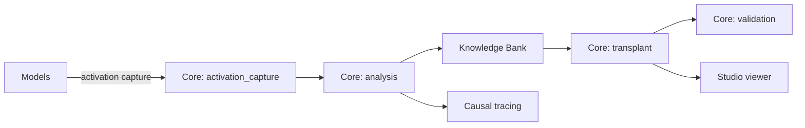

# Architecture Overview

LLM Ripper is organized as a modular framework around extraction, analysis, transplantation, and validation of knowledge from Transformer-based language models.

## High-level flow

## Packages
- llm_ripper.core
  - activation_capture.py: capture activations to HDF5/NP arrays
  - analysis.py: component/feature analysis, head catalogs
  - extraction.py: build Knowledge Bank assets
  - transplant.py: modular transplant strategies
  - validation.py: quantitative checks, diagnostics
- llm_ripper.utils
  - model_loader.py: safe/controlled model loading
  - run.py: run directory and artifact writers
  - config.py: configuration helpers
- llm_ripper.causal: tracing utilities
- llm_ripper.interop: adapters and merging
- llm_ripper.safety: provenance and reports
- llm_ripper.studio: lightweight static viewer

## Artifacts structure (RunContext)
Runs are created under runs/<timestamp>/ with subdirectories:
- knowledge_bank, activations, analysis, transplants, validation, causal, traces, counterfactuals, uq, catalog, provenance, reports

See docs/api.md for API reference and README for quickstart.
