# 🏗️ Architecture Overview

LLM Ripper is designed as a **modular framework** around the core processes of extraction, analysis, transplantation, and validation of knowledge from Transformer-based language models.

## 🎯 Design Philosophy

LLM Ripper follows these core principles:

- **🔧 Modularity**: Each component has a single responsibility
- **🛡️ Safety First**: Built-in validation and safety checks throughout
- **🔄 Reproducibility**: Standardized pipelines with artifact tracking
- **⚡ Performance**: Optimized for both research and production use
- **🎨 Extensibility**: Easy to add new analysis methods and model types

## 📊 High-Level Architecture

```mermaid
flowchart TD
    A[🤖 Language Model] --> B[📥 Activation Capture]
    B --> C[🔍 Analysis Engine]
    C --> D[📚 Knowledge Bank]
    D --> E[🔄 Transplant Engine]
    E --> F[✅ Validation Suite]
    
    C --> G[🧠 Causal Tracing]
    C --> H[📊 Component Analysis]
    E --> I[🎨 Studio Viewer]
    F --> J[📋 Safety Reports]
    
    subgraph "Core Pipeline"
        B
        C  
        E
        F
    end
    
    subgraph "Analysis Tools"
        G
        H
        I
    end
    
    subgraph "Output & Validation"
        D
        J
    end
```



## 📦 Package Structure

### 🎯 Core Modules (`llm_ripper.core`)

The heart of LLM Ripper's functionality:

| Module | Purpose | Key Features |
|--------|---------|--------------|
| **`activation_capture.py`** | Capture model internals | • Hook-based activation extraction<br/>• HDF5/NumPy array storage<br/>• Memory-efficient streaming |
| **`analysis.py`** | Component & feature analysis | • Attention pattern analysis<br/>• Component importance scoring<br/>• Head behavior cataloging |
| **`extraction.py`** | Build Knowledge Bank assets | • Component extraction<br/>• Knowledge representation<br/>• Artifact generation |
| **`transplant.py`** | Modular transplant strategies | • Cross-model knowledge transfer<br/>• Safety-aware transplantation<br/>• Multiple transplant methods |
| **`validation.py`** | Quantitative checks & diagnostics | • Behavior validation<br/>• Performance benchmarking<br/>• Safety assessment |

### 🔧 Utilities (`llm_ripper.utils`)

Supporting infrastructure and helpers:

| Module | Purpose | Key Features |
|--------|---------|--------------|
| **`model_loader.py`** | Safe model loading | • Trust-aware loading<br/>• Memory optimization<br/>• Multi-format support |
| **`run.py`** | Run management | • Artifact tracking<br/>• Directory organization<br/>• Metadata management |
| **`config.py`** | Configuration management | • YAML/JSON configs<br/>• Validation schemas<br/>• Environment handling |
| **`architecture.py`** | Model introspection | • Architecture detection<br/>• Component mapping<br/>• Compatibility checks |
| **`storage.py`** | Data persistence | • Efficient serialization<br/>• Compression support<br/>• Format conversion |

### 🧠 Specialized Modules

Advanced analysis and integration capabilities:

| Package | Purpose | Key Features |
|---------|---------|--------------|
| **`llm_ripper.causal`** | Causal tracing utilities | • Intervention analysis<br/>• Causal effect measurement<br/>• Attribution methods |
| **`llm_ripper.interop`** | Adapters & merging | • LoRA/adapter support<br/>• Model merging<br/>• Format conversion |
| **`llm_ripper.safety`** | Safety & monitoring | • Bias detection<br/>• Toxicity screening<br/>• Behavior monitoring |
| **`llm_ripper.features`** | Feature analysis | • Sparse autoencoders<br/>• Feature interpretation<br/>• Activation clustering |
| **`llm_ripper.studio`** | Web interface | • Interactive visualization<br/>• Result browsing<br/>• Real-time monitoring |

## 🔄 Data Flow

### 1. 📥 Capture Phase

```python
# Model activations are captured using PyTorch hooks
activations = capture_activations(
    model=model,
    inputs=tokenized_text,
    layers=target_layers,
    components=["attention", "ffn", "embeddings"]
)
```

**Data Format**: Raw activations → HDF5 files with metadata

### 2. 🔍 Analysis Phase  

```python
# Activations are analyzed for patterns and importance
analysis_results = analyze_components(
    activations=activations,
    methods=["gradient", "attention_weight", "integrated_gradient"],
    metrics=["importance", "sparsity", "correlation"]
)
```

**Data Format**: Analysis results → JSON reports + visualization data

### 3. 📚 Knowledge Bank Creation

```python  
# Important components are extracted and cataloged
knowledge_bank = build_knowledge_bank(
    analysis_results=analysis_results,
    extraction_threshold=0.7,
    include_metadata=True
)
```

**Data Format**: Structured knowledge → Searchable database + artifacts

### 4. 🔄 Transplant Phase

```python
# Knowledge is transferred between models with validation
transplant_result = transplant_knowledge(
    source_knowledge=knowledge_bank,
    target_model=target_model,
    safety_checks=True,
    validation_suite=True
)
```

**Data Format**: Modified model weights → New model + validation reports

## 🛡️ Safety Architecture

Safety is integrated at every level:

### Input Validation
- Model compatibility checking
- Input sanitization  
- Resource limit enforcement

### Process Monitoring
- Memory usage tracking
- Progress reporting
- Error handling & recovery

### Output Validation
- Behavior consistency checks
- Safety metric evaluation
- Artifact integrity verification

## ⚡ Performance Optimizations

### Memory Management
- **Streaming processing** for large models
- **Activation checkpointing** to reduce memory usage
- **Lazy loading** of model components

### Computation Optimization
- **Batched operations** for efficiency
- **GPU acceleration** where available
- **Parallel processing** for independent operations

### Storage Efficiency
- **Compressed artifacts** using HDF5/Parquet
- **Incremental saving** for large analyses
- **Deduplication** of common components

## 🔌 Extension Points

LLM Ripper is designed to be easily extensible:

### Custom Analysis Methods

```python
class CustomAnalyzer(BaseAnalyzer):
    def analyze(self, activations):
        # Your custom analysis logic
        return analysis_results
```

### New Transplant Strategies

```python
class CustomTransplanter(BaseTransplanter):
    def transplant(self, source_knowledge, target_model):
        # Your custom transplant logic
        return transplant_result
```

### Additional Safety Checks

```python
class CustomValidator(BaseValidator):
    def validate(self, model, test_data):
        # Your custom validation logic
        return validation_result
```

## 🎨 Studio Architecture

The web-based Studio interface is built with:

- **Backend**: FastAPI server with WebSocket support
- **Frontend**: Modern JavaScript with real-time updates
- **Visualization**: D3.js and Plot.ly for interactive charts
- **Data**: Direct access to analysis artifacts and results

## 📈 Scalability Considerations

### Horizontal Scaling
- **Distributed analysis** across multiple machines
- **Cloud-native deployment** with containerization
- **API-first design** for service integration

### Vertical Scaling
- **Multi-GPU support** for large model analysis
- **Memory-mapped storage** for huge datasets
- **Progressive loading** for interactive exploration

## 🔮 Future Architecture

Planned improvements and additions:

### Enhanced Modularity
- **Plugin system** for community extensions
- **Microservice architecture** for cloud deployment
- **API-driven components** for better integration

### Advanced Analytics
- **Real-time analysis** capabilities
- **Streaming model analysis** for continuous monitoring
- **Federated learning** support for distributed models

### Better Integration
- **Native cloud platform** support (AWS, GCP, Azure)
- **MLOps pipeline** integration
- **Experiment tracking** with popular tools (W&B, MLflow)

---

<div align="center" markdown="1">

**Want to see the architecture in action?**

[Try the Quick Start :material-rocket:](quickstart.md){ .md-button .md-button--primary }
[Browse Examples :material-book-open:](guides/end_to_end.md){ .md-button }

</div>
- llm_ripper.safety: provenance and reports
- llm_ripper.studio: lightweight static viewer

## Artifacts structure (RunContext)
Runs are created under runs/<timestamp>/ with subdirectories:
- knowledge_bank, activations, analysis, transplants, validation, causal, traces, counterfactuals, uq, catalog, provenance, reports

See docs/api.md for API reference and README for quickstart.
