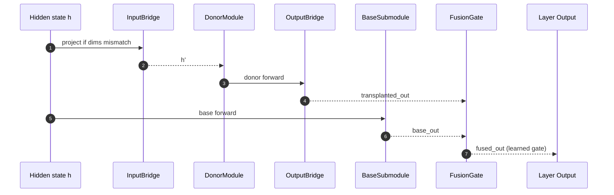

# Transplant Strategies

- Embedding initialization
- Module injection with bridges
- Adapter Fusion (multi-adapter layers)

## Architecture Overview

```mermaid
flowchart TD
  A[Donor Model] -->|extract| KB[Knowledge Bank]
  A -->|capture| ACT[Activations (HDF5)]
  KB -->|analyze| ANALYSIS[Analysis & Catalog]

  subgraph Interop & Bridges
    MERGE[merge --global]:::op
    ADAPT[adapters --import/--fuse]:::op
    TOK[tokenize-align]:::op
    ALIGN[bridge-align]:::op
    BTRAIN[bridge-train --mixture]:::op
  end

  ANALYSIS --> ALIGN
  KB --> ALIGN
  MERGE --> MRGD[Merged Model]
  MRGD --> TRANS[Transplanted Model]
  KB -->|transplant| TRANS
  ADAPT --> TRANS

  classDef op fill:#eef,stroke:#446,stroke-width:1px;
```

## Injection Flow (Module + Bridges + Gate)



## Notes

- Embedding Initialization: If donor/target dims differ, an input bridge aligns donor embeddings to target space and initializes target embeddings accordingly.
- Module Injection: Donor module wrapped with input/output bridges; injected on target layer; fusion gate combines base and transplanted paths.
- Adapter Fusion: Multiple transplanted modules on a layer; a gate (or attention-like combiner) fuses outputs from adapters into the base path.

## Strategy Selection (Rules of Thumb)

- Embedding Initialization:
  - Use when transferring vocabulary/semantic priors and alignment error is small (after `bridge-align`, cosine↑, MSE↓).
  - Good first step when donor/target are architecturally similar and you want a quick measurable gain.
- Module Injection + Bridges:
  - Use when causal tracing highlights specific heads/FFN parts with strong Δ-impact.
  - Bridges reconcile dim mismatches; prefer for surgical, interpretable transplants.
- Adapter Fusion (Multi-Adapter Layers):
  - Use when multiple candidates on the same layer show complementary effects or reduce variance across tasks.
  - Attach a fusion gate and, if needed, fine-tune gate alphas (kept lightweight).
- Mixture-of-Bridges Training:
  - Use to stabilize performance on heterogeneous tasks by learning k specialists with a small gate.
  - Train only adapters and gate offline/self-supervised to match base layer outputs (MSE objective).
- Bridge-Align (Procrustes) Pre-Step:
  - Run before injection to reduce geometric distortion donor→target; improves warm-start of bridges.
- Evidence Gathering:
  - Run `trace` first to rank candidates; confirm with counterfactuals (`cfgen/cfeval`) on minimal pairs.
  - Cross-check with UQ (`uq`) to ensure no-regress under uncertainty; route to baseline when UQ > τ (`route-sim`).

## Strategy Decision Flow

```mermaid
flowchart TD
  S([Start]) --> A{Aligned donor→target?\n(cos↑, MSE↓)}
  A -- No --> BA[Run bridge-align]\n--> A
  A -- Yes --> T{High Δ-impact targets?\n(trace)}
  T -- Yes --> INJ[Module injection + bridges]
  T -- No --> V{Need vocab/semantics transfer?}
  V -- Yes --> EMB[Embedding initialization]
  V -- No --> H{Heterogeneous tasks?}
  H -- Yes --> MOB[Mixture-of-bridges training]
  H -- No --> L{Multiple candidates per layer?}
  L -- Yes --> AF[Adapter Fusion]
  L -- No --> VAL[Validate + UQ]

  INJ --> VAL
  EMB --> VAL
  MOB --> VAL
  AF  --> VAL

  VAL --> CF[Counterfactuals (cfgen/cfeval)]
  VAL --> UQ[UQ + route-sim (τ)]
  UQ  --> REP[Report + Studio]
  CF  --> REP
```
